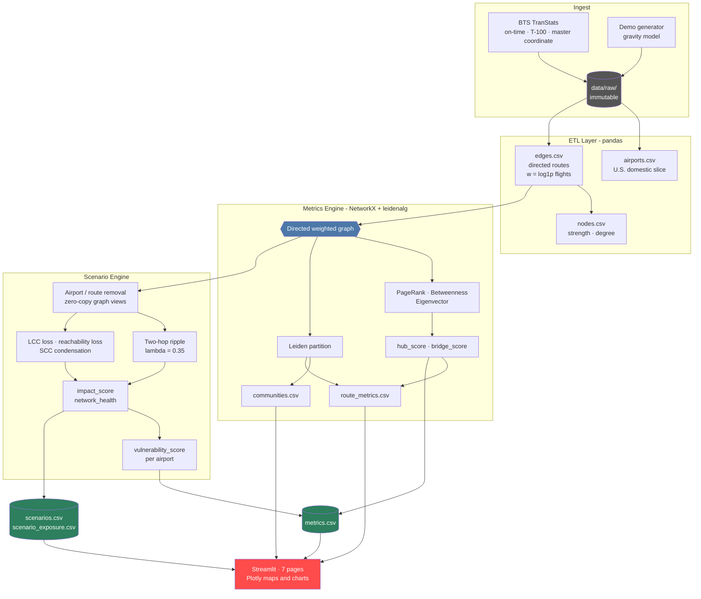

# ATNA


**ATNA** (Air Traffic Network Analysis) is an interactive visual analytics and scenario editing tool that turns a month of U.S. Bureau of Transportation Statistics flight records into a directed weighted airport graph, then scores every airport and route on how structurally load-bearing it is. Remove an airport or a route in the scenario editor and the app recomputes connectivity loss, 2-hop ripple exposure, and a network health score in under a second, against the live graph rather than a precomputed lookup.

It answers questions a raw traffic table cannot. Denver and Charlotte move similar passenger volume, so why does removing Charlotte hurt the network more? Traffic rank and structural importance are different things, and the gap between them is the whole point of the project.

This project was built as a team project at Texas A&M University against an MVP technical specification that defines the data model, the metric formulas, and the CSV column contracts.

---

### Project Status & Architecture Note
**Current Release: Full Pipeline, Scenario Engine, and Seven-Page Application**

This repository contains the complete analysis stack:
- Configuration-driven ETL from raw BTS extracts to canonical graph tables
- Graph metrics engine with PageRank, betweenness, and Leiden community detection
- Scenario engine with 2-hop ripple propagation and per-airport vulnerability scoring
- Seven-page Streamlit application with Plotly maps and a revertible scenario editor
- 92 tests covering column contracts, metric math, artifact reproducibility, loader guards, and headless page rendering
- Continuous integration running lint, type checks, and the full pipeline on Python 3.10 through 3.13

**Synthetic Demo Dataset (recently added):** The BTS extracts are large, rate limited, and not redistributable, so a fresh clone previously had no data and the application was dead on arrival. A generator now writes BTS-shaped raw CSVs that the unmodified pipeline consumes exactly like production input, which also lets the data-dependent half of the test suite run on any machine.

**Raw Data (not included):** `data/raw/` is gitignored and immutable in place. Refreshing data means writing to a new path rather than overwriting existing bytes, so prior inputs stay inspectable and results stay reproducible. The automated downloader is included, but TranStats throttles aggressively and a manual fallback is documented.

---

## Validation

Every score here is a modelling output, so one section exists to ask whether those
outputs correspond to anything that happened.

Between 21 and 29 December 2022 a winter storm and a carrier collapse took a large
share of U.S. domestic capacity offline: system-wide cancellations went from 0.6% to a
peak of **27.6%**, then back to 0.7%. That is a natural experiment.

The network is built from **November 2022**, so nothing about the event informs the
graph. The six airports where the disruption actually originated are identified from
the data itself, removed simultaneously in the ripple model, and the predicted exposure
of every *other* airport is compared against the degradation it actually suffered.

| Measure | Value | p |
|---|---:|---:|
| Spearman ρ, predicted exposure vs observed damage | **+0.387** | 1.6 × 10⁻⁶ |
| Partial ρ, controlling for airport size | **+0.386** | 1.8 × 10⁻⁶ |
| Airport size alone vs observed damage | +0.246 | — |

Large airports both attract more predicted exposure and cancel more flights in any
disruption, so size is the obvious objection. Partialling it out of both variables
leaves the relationship essentially untouched: **exposure carries information beyond
airport size**.

This is one event, the correlation is moderate, and geography is a confounder the test
cannot separate from network position. [The full write-up](docs/validation_december_2022.md)
states what the result does and does not establish.

### Are the scores stable?

Across two real consecutive months, over the 345 airports present in both:

| Score | Spearman ρ, Nov vs Dec 2022 |
|---|---:|
| `hub_score` | **+0.972** |
| `bridge_score` | +0.912 |
| `vulnerability_score` | +0.963 |

Stable, even though December 2022 contained the largest domestic disruption in years.
And the exceptions have a reason: the four biggest movers are HDN, EGE, GUC, and MTJ —
all Colorado ski airports picking up seasonal service. Stable where the network is
stable, moving where service genuinely changed.

---

## Performance

The pipeline was optimized against a synthetic 350-airport, 15,000-route graph. The real U.S. domestic network turns out to be sparser than that: a November 2022 snapshot is 348 airports and 5,657 routes, so the figures below are a conservative upper bound on real cost. The expensive operation is the vulnerability batch, which removes every airport in turn and rescores the whole network each time. That is N scenarios over an N node, E edge graph, so a naive implementation degrades sharply exactly when the dataset gets interesting.

| Operation | Before | After | Speedup |
|---|---:|---:|---:|
| `reachable_pairs_count`, single call | 16.8 ms | 2.3 ms | **7.2x** |
| Vulnerability batch, 350 scenarios | 9.23 s | 0.33 s | **28x** |

Every change below is structural. Artifact values and CSV column order are identical
before and after, checked by regenerating the artifacts and diffing them byte for byte.

### 1. Counting Reachable Pairs Without Traversing Per Node
Reachability loss needs the number of ordered reachable pairs. The direct reading of that definition is a breadth-first sweep from every node, which is O(V * (V + E)) per scenario, repeated N times.

Every node inside a strongly connected component reaches exactly the same set of nodes. So one Tarjan pass condenses the graph, and a reverse-topological bitset union over the condensation DAG yields the count directly:

```text
reachable_pairs = sum over components C of |C| * (nodes reachable from C - 1)
```

- One O(V + E) pass replaces V full traversals
- Single call latency: **16.8ms to 2.3ms**, a 7.2x improvement
- Verified identical to the per-node count across 300 randomized graphs, including empty, single-node, isolated, and fully disconnected cases

### 2. Removing Airports Without Copying the Graph
Each scenario built a full `DiGraph.copy()` to delete one node, duplicating the entire adjacency structure to hide a single vertex. That is O(V + E) per scenario and was 72% of remaining runtime after the first optimization.

The scored graph is read only, since it is never mutated and never returned. The engine now uses `nx.restricted_view`, which hides the node in O(1) and reads identically.

- **Public API preserved:** `remove_airport` and `remove_route` still return real copies by default, so external callers keep their mutable-graph contract
- **Opt-in only:** `copy=False` is documented and used exclusively on the internal read-only path

### 3. Hoisting Invariants Out of the Batch Loop
Every scenario in the batch removes one airport from the same unchanged baseline, so the normalized neighbor shares, the undirected dependency weights, and the baseline reachable-pair count are loop invariants. All three are computed once and threaded through rather than re-derived per airport.

The same three values are cached in the Streamlit layer, where they were previously rebuilt on every Simulate click.

**Combined result so far:** vulnerability batch **9.23s to 2.61s**, a 3.5x improvement.

### 4. Taking the Sweep Out of NetworkX Entirely
With the copies gone, the remaining per-scenario cost was the two connectivity counts
the scoring formulas need: the largest weakly connected component, and the number of
reachable ordered pairs. Both were still measured by rebuilding NetworkX structures for
each of the N edited graphs.

Those counts depend only on the edge list, so `ConnectivityIndex` builds integer edge
arrays from the baseline once and answers each removal with a boolean mask plus SciPy's
compiled component routines, falling back to the condensation bitset union only when
the remaining graph is not already strongly connected.

- Vulnerability batch: **2.61s to 0.33s**, and **9.23s to 0.33s overall, a 28x improvement**
- Growth per doubling of network size fell from 4.1x to roughly 3.4x
- Both counts are integers, so every downstream float is bit-identical
- `reachable_pairs_count` stays as the reference implementation, and the index is
  checked against it across sparse, dense, disconnected, chain, and isolated-node graphs

### 5. Parsing Each Raw Extract Once Per Run
The airports builder and the edges builder each loaded the U.S. domestic on-time slice independently, so a full run parsed the largest raw input twice. The nodes builder then read `edges.csv` straight back off the disk the pipeline had just written it to.

- Both builders now accept a preloaded frame, matching the existing shared-load pattern
- The nodes builder reuses the in-memory edges frame
- `airports.csv`, `edges.csv`, and `nodes.csv` are byte-identical before and after

**A note on correctness:** every optimization above is structural rather than numerical. Artifact values and CSV column order are unchanged, verified by regenerating `metrics.csv` and diffing it byte for byte. Three properties the optimizations depend on are pinned by tests: supplying precomputed baseline inputs yields byte-identical scenario rows, index-derived connectivity counts match measuring the edited graph, and running a scenario never mutates the shared baseline graph.

---

## Key Features

- **Hub Scoring** - Blends traffic strength, PageRank, and degree into a single 0 to 100 percentile score, so a small airport with outsized connectivity is not buried under raw volume
- **Bridge Detection** - Ranks airports by betweenness on the inverse-weight graph, surfacing the connectors whose loss forces long detours
- **Leiden Communities** - Partitions the network into regional clusters and flags the cross-community routes that stitch them together
- **Scenario Editor** - Remove any airport or route and get connectivity loss, ripple exposure, and network health against the live graph, with every edit revertible and the history inspectable
- **Vulnerability Index** - Precomputes the impact of removing each airport individually, so the whole network can be ranked by fragility rather than probed one guess at a time
- **Route Criticality** - Scores every directed route on weight percentile plus a cross-community bonus, ranking the links that carry structural rather than merely heavy load
- **Reproducible Artifacts** - Every stage writes CSVs under `data/processed/{snapshot_id}/` and the next stage reads them, so stages are independently runnable and independently testable
- **One-Command Bootstrap** - A cold clone reaches a working application in about a minute, with no database, no API keys, and no accounts

## Planned Features

The MVP deliberately draws its scope tight. The following are outside the current specification and are the natural next steps:

### Multi-Month Snapshot Comparison
The pipeline is built around a single monthly snapshot selected in `config/atna.yaml`. Extending the artifact layout to hold several months side by side would allow seasonal comparison, showing how hub and bridge rankings shift between summer and winter schedules, and how community boundaries move with seasonal routes.

**Technical Implementation:**
- Snapshot-aware artifact loaders already filter on `snapshot_id`, so the storage layer largely exists
- Requires a snapshot selector in the application shell and a diff view for ranking changes between two months

### Deeper Ripple Propagation
Ripple exposure currently stops at 2 hops with a fixed discount on the second. Extending to configurable depth with per-hop discounting would model wider structural cascades, at the cost of a larger and harder-to-interpret exposure table.

### Additional Planned Work
- **International Routes:** The current slice is U.S. domestic only, filtered on the master coordinate country code
- **Carrier-Level Decomposition:** Raw extracts carry carrier identifiers that the graph currently aggregates away, so per-airline network structure is available but unused
- **Scenario Comparison View:** Run several scenarios and compare impact side by side rather than one at a time
- **Artifact Export:** Download filtered tables and generated figures directly from the application

---

## System Architecture

The application uses a staged pipeline architecture where each stage writes canonical CSV artifacts and the next stage reads them. The Streamlit layer only ever reads artifacts and never recomputes the pipeline.



## Technology Stack

### Pipeline
- **Language**: Python 3.10+
- **Data Processing**: pandas, NumPy
- **Configuration**: PyYAML, single checked-in `config/atna.yaml`
- **Testing**: pytest
- **Linting and types**: Ruff, mypy

### Graph and Metrics
- **Graph Library**: NetworkX
- **Community Detection**: python-igraph, leidenalg
- **Numerics**: SciPy

### Application
- **Framework**: Streamlit
- **Charts and Maps**: Plotly
- **Testing**: Streamlit `AppTest` for headless page rendering

### Data Acquisition
- **Automation**: Playwright, headless Chromium against BTS TranStats
- **Verification**: File count and non-empty checks against a manifest

## Project Structure

```
ATNA/
├── config/atna.yaml            # Snapshot month + resolved raw/processed paths
├── src/
│   ├── etl/                    # BTS extracts to airports.csv, edges.csv, nodes.csv
│   │   ├── load_raw.py         #   typed readers, U.S. domestic filter
│   │   ├── build_airports.py   #   master coordinate join
│   │   ├── build_edges.py      #   route aggregation, log1p analysis weight
│   │   ├── build_nodes.py      #   strength and degree rollups
│   │   └── run_pipeline.py     #   stage entrypoint
│   ├── metrics/                # Graph construction and scoring
│   │   ├── graph_builder.py    #   validated DiGraph build
│   │   ├── centralities.py     #   PageRank, betweenness, eigenvector
│   │   ├── percentile.py       #   shared 0 to 100 percentile operator
│   │   ├── hub_bridge.py       #   composite hub and bridge scores
│   │   ├── leiden_communities.py #  partition and community rollups
│   │   ├── route_criticality.py  #  per-route structural scoring
│   │   └── run_metrics.py      #   stage entrypoint
│   ├── scenarios/              # What-if engine
│   │   ├── graph_edits.py      #   copy or zero-copy view removals
│   │   ├── ripple.py           #   two-hop propagation, lambda = 0.35
│   │   ├── scoring.py          #   LCC, reachability, impact, health
│   │   ├── vulnerability.py    #   per-airport batch scoring
│   │   ├── engine.py           #   orchestration and deterministic scenario ids
│   │   └── run_scenarios.py    #   stage entrypoint
│   └── app/                    # Streamlit application
│       ├── streamlit_app.py    #   router shell
│       ├── data_loader.py      #   cached, schema-guarded artifact loaders
│       ├── scenario_service.py #   session state, history, revert
│       ├── pages/              #   overview, network map, airport explorer,
│       │                       #   communities, route explorer, scenario editor,
│       │                       #   methodology
│       └── ui/                 #   shared components and formatters
├── scripts/
│   ├── demo/generate_demo_data.py  # Synthetic BTS-shaped dataset
│   ├── docs/capture_ui.py          # Playwright UI capture to annotated PDF
│   ├── download/                   # Playwright TranStats downloader + verifier
│   └── metrics/                    # Static map QA checks
├── setupScripts/               # One-command setup / start / pipeline (sh + bat)
│   ├── setup.sh / setup.bat        # Environment, dependencies, data bootstrap
│   ├── start.sh / start.bat        # Launch the Streamlit application
│   └── pipeline.sh / pipeline.bat  # Rebuild all processed artifacts
├── tests/                      # 92 tests
├── data/                       # raw (gitignored), interim, processed, reference
├── organization/               # MVP technical specification
├── .github/workflows/ci.yml    # Lint + full pipeline + tests on 3.10 to 3.13
├── pyproject.toml              # Ruff and pytest configuration
└── README.md                   # This file
```

## Quick Start

### Prerequisites

| Requirement | Version | Purpose | Download |
|------------|---------|---------|----------|
| Python | v3.10+ | Entire pipeline and application | [python.org](https://www.python.org/) |
| git | any | Cloning the repository | [git-scm.com](https://git-scm.com/) |

No database, no API keys, and no accounts are required.

### Automated Installation (Recommended)

The fastest way to get started is using the automated setup script:

**macOS/Linux:**
```bash
# 1. Clone the repository
git clone https://github.com/sahil-d-patel/ATNA.git
cd ATNA

# 2. Run the automated setup script
./setupScripts/setup.sh --demo
```

**Windows:**
```batch
REM 1. Clone the repository
git clone https://github.com/sahil-d-patel/ATNA.git
cd ATNA

REM 2. Run the automated setup script
setupScripts\setup.bat --demo
```

The setup script will:
- Check that Python 3.10+ is available
- Create a virtual environment in `.venv`
- Install all Python dependencies from `requirements.txt`
- Generate a synthetic demo snapshot so the application has data immediately
- Run the full pipeline: ETL, then metrics, then scenarios
- Execute the test suite as a sanity check

**Starting the Application:**

After setup completes, start the application with:

```bash
# macOS/Linux
./setupScripts/start.sh

# Windows
setupScripts\start.bat
```

The application will be available at [http://localhost:8501](http://localhost:8501).

### Setup Options

| Flag | Behavior |
|------|----------|
| `--demo` | Non-interactive, bootstraps the synthetic demo snapshot |
| `--data` | Full BTS download through Playwright, then the real pipeline |
| `--skip-data` | Environment only, no data bootstrap |
| `-y` | Assume yes at prompts |

### About the Demo Dataset

The BTS extracts are large, rate limited, and not redistributable, so a fresh clone has no data. Rather than leaving the application dead on arrival, `--demo` synthesizes a BTS-shaped dataset that the unmodified pipeline consumes exactly like production input.

- **Real:** identifiers, IATA codes, cities, and coordinates for the 50 busiest U.S. airports
- **Synthetic:** every flight, passenger, seat, and delay figure, drawn from a gravity model of hub mass over great-circle distance

Two modeling choices keep the result structurally honest. A hub-and-spoke gate means small airports connect through hubs instead of to each other, because a plain gravity model connects nearly every pair and collapses the community structure. Service is decided per unordered pair, because airlines schedule round trips, and drawing directions independently would leave one-way routes everywhere and break strong connectivity.

**Result:** 1,276 directed routes carrying roughly 387,000 completed flight legs. Leiden recovers four regional communities that line up with real U.S. aviation geography:

| Community | Top airports by hub score |
|-----------|---------------------------|
| West | DEN, LAX, LAS, PHX, SEA, SFO |
| Midwest | ORD, ATL, DTW, CMH, MDW, CVG |
| South | DFW, IAH, MCO, MIA, TPA, FLL |
| Northeast | CLT, JFK, BOS, DCA, BWI, IAD |

ORD and ATL top the hub rankings. Output is deterministic for a given `--seed`.

### Manual Installation (Alternative)

If you prefer manual setup or need more control:

```bash
# 1. Clone the repository
git clone https://github.com/sahil-d-patel/ATNA.git
cd ATNA

# 2. Create and activate a virtual environment
python3 -m venv .venv
source .venv/bin/activate

# 3. Install dependencies
pip install -r requirements.txt

# 4. Generate a demo snapshot (or download real BTS data instead)
PYTHONPATH=src python scripts/demo/generate_demo_data.py

# 5. Run the pipeline
PYTHONPATH=src python -m etl.run_pipeline
PYTHONPATH=src python -m metrics.run_metrics
PYTHONPATH=src python -m scenarios.run_scenarios

# 6. Start the application
PYTHONPATH=src streamlit run src/app/streamlit_app.py
```

### Running on Real BTS Data

```bash
./setupScripts/setup.sh --data
```

This downloads on-time performance, T-100 segment, and master coordinate files for the year configured in `config/atna.yaml`, then runs the full pipeline. TranStats throttles aggressively, so [`scripts/download/MANUAL_BTS_DOWNLOAD.md`](scripts/download/MANUAL_BTS_DOWNLOAD.md) documents the manual fallback.

---

## Metrics and Formulas

The data model, formulas, and CSV column contracts are defined in [`organization/ATNA_MVP_Technical_Spec_and_Workflow.md`](organization/ATNA_MVP_Technical_Spec_and_Workflow.md), and the implementation is tested against them.

`P(x)` is percentile rank scaled to 0 through 100, which puts otherwise incomparable metrics on one axis.

| Metric | Formula |
|---|---|
| Analysis edge weight | `w(i,j) = log(1 + flight_count(i,j))` |
| Hub score | `0.50 * P(strength_total) + 0.30 * P(PageRank) + 0.20 * P(degree_total)` |
| Bridge score | `P(betweenness)` on the inverse-weight graph |
| Vulnerability | `0.60 * P(impact of removing i) + 0.40 * P(bridge_score)` |
| Route criticality | `0.70 * P(w(i,j)) + 0.30 * cross_community_flag` |
| Impact score | `0.40 * lcc_loss + 0.30 * reachability_loss + 0.30 * ripple_severity` |
| Network health | `100 - impact_score` |
| Ripple exposure | Two hops, dependency shares, `lambda = 0.35` on the second hop |

**Why betweenness runs on inverse weight:** NetworkX treats edge weight additively as cost, so a heavily trafficked route must map to a *shorter* structural distance. The graph passed to betweenness therefore uses `1/w` rather than `w`.

### Known Limitations

These are properties of the model, verified against this implementation rather than assumed. The Methodology page in the application carries the full write-up.

**Ripple severity favours low-degree airports.** Removing an airport releases a fixed shock of 100 distributed across its neighbours in proportion to `Share(i,j)`, which normalises by that airport's own total dependency. A hub with 60 neighbours spreads roughly 1.7 to each, below the severity threshold of 10, and scores zero. A peripheral airport with four neighbours concentrates 25 onto each and scores highly. The vulnerability ranking can therefore place mid-size airports above the largest hubs. Read `ripple_severity` as concentration of local dependency, not network-wide importance.

**Connectivity terms go flat on well-connected networks.** `LCC_Loss` and `Reachability_Loss` only separate airports when a removal actually disconnects something. If every airport has two independent paths into the core, both terms collapse to the same constant for every airport and `ImpactScore` reduces to its ripple term alone. Check the spread of those columns before drawing conclusions from impact.

**Percentile ties use the max rule.** The specification defines `P()` but not a tie-breaking rule. Every composite here uses max-rank, so the top value always reaches exactly 100. `ImpactScore` often takes only a handful of distinct values per snapshot, producing large tie groups where comparing two airports is not meaningful.

**Eigenvector centrality requires strong connectivity.** It is a secondary metric, written as an empty column when the snapshot is not strongly connected rather than filled with a misleading value. The pipeline logs a warning when that happens.

### Generated Artifacts

| Artifact | Contents |
|----------|----------|
| `airports.csv` | One row per airport in the U.S. domestic slice, with coordinates and metadata |
| `edges.csv` | Directed routes with flight counts, passengers, seats, delay stats, analysis weight |
| `nodes.csv` | Per-airport strength and degree rollups |
| `metrics.csv` | PageRank, betweenness, eigenvector, hub, bridge, vulnerability, community id |
| `communities.csv` | Community size, traffic, internal density, top hubs and bridges |
| `route_metrics.csv` | Per-route criticality score and cross-community flag |
| `scenarios.csv` | One row per scenario with impact, health, and component loss scores |
| `scenario_exposure.csv` | Per-airport ripple exposure and rank within each scenario |

---

## Testing

ATNA includes test coverage across the ETL, metrics, scenario, and application layers.

### Running Tests

```bash
# Run all tests
PYTHONPATH=src .venv/bin/python -m pytest tests -q

# Run a single module
PYTHONPATH=src .venv/bin/python -m pytest tests/test_scenario_ripple_scoring.py -q

# Skip the slower headless application tests
PYTHONPATH=src .venv/bin/python -m pytest tests -q -k "not streamlit"
```

### Test Coverage

**92 tests, all passing, no skips**, in roughly 3 seconds end to end.

- **ETL**: column and join contracts for all three canonical tables, roundtrip writes
- **Metrics**: centrality math, hub and bridge composites, Leiden partition coverage, route criticality
- **Scenarios**: graph-edit isolation, ripple propagation, scoring formulas, artifact schemas, vulnerability integration
- **Application**: artifact loader guards including schema validation, snapshot mismatch, and cache invalidation, plus headless `AppTest` coverage rendering all seven pages
- **Optimization guarantees**: precomputed baseline inputs produce byte-identical scenario rows, and running a scenario never mutates the shared baseline graph
- **Reproducibility**: eigenvector centrality is bitwise stable across repeated calls, so a frozen input month yields a frozen artifact

**On the demo dataset and test coverage:** because the generator produces a complete dataset, data-dependent tests execute against real artifacts on any machine rather than skipping. Before it existed, 18 of 45 tests silently skipped on a fresh clone, which meant the suite reported success while a third of the pipeline went untested.

### Continuous Integration

Every push and pull request runs Ruff, mypy, and the full suite on Python 3.10, 3.11, 3.12, and 3.13. Because the BTS extracts cannot be published, CI generates the synthetic snapshot and runs ETL, metrics, and scenarios end to end, so the pipeline itself is exercised rather than only the import-safe unit tests.

---

## Development Commands

```bash
# Setup (First Time)
./setupScripts/setup.sh --demo      # Full bootstrap with synthetic data
./setupScripts/setup.sh --data      # Full bootstrap with real BTS download
./setupScripts/setup.sh --skip-data # Environment only

# Start Application
./setupScripts/start.sh             # Launch the Streamlit application

# Rebuild Data
./setupScripts/pipeline.sh          # ETL, then metrics, then scenarios

# Individual Stages
PYTHONPATH=src .venv/bin/python scripts/demo/generate_demo_data.py --force
PYTHONPATH=src .venv/bin/python -m etl.run_pipeline
PYTHONPATH=src .venv/bin/python -m metrics.run_metrics
PYTHONPATH=src .venv/bin/python -m scenarios.run_scenarios

# Testing and Linting
PYTHONPATH=src .venv/bin/python -m pytest tests -q
.venv/bin/ruff check src tests scripts
.venv/bin/python -m mypy

# Data Acquisition
python scripts/download/download_bts_data.py
python scripts/download/verify_downloads.py --year 2025
```

### Changing the Snapshot Month

Edit `snapshot_id` in [`config/atna.yaml`](config/atna.yaml) to a `YYYY-MM` value, make sure raw CSVs exist for that month, then re-run the pipeline. Path templates expand `{year}`, `{month}`, and `{snapshot_id}` automatically, so no other file needs to change.

### Raw Data Policy

`data/raw/` is immutable in place. Do not silently overwrite an existing raw file with a new fetch. If you need to refresh data, use a new path such as a dated subfolder or a filename suffix, so prior bytes remain inspectable for reproducibility and audit.

---

## Documentation

| Document | Purpose |
|---|---|
| [Technical specification](organization/ATNA_MVP_Technical_Spec_and_Workflow.md) | Data model, formulas, and workflow |
| [Spec pointer](docs/specs/README.md) | Short pointer and rationale |
| [Data sources](data/reference/README_data_sources.md) | BTS tables and why each is used |
| [Field selection notes](data/reference/field_selection_notes.md) | Exact TranStats fields per download |
| [Download spec](docs/data_download_spec.md) | Raw file naming and layout |
| [Manual download](scripts/download/MANUAL_BTS_DOWNLOAD.md) | Fallback when TranStats blocks automation |
| [Interface walkthrough](docs/ui/ATNA-interface.pdf) | Annotated PDF of every page, generated from the running app |
| [Contributing](CONTRIBUTING.md) | Setup, the artifact contract, and conventions |
| [Validation notes](data/reference/validation_notes_mvp.md) | Snapshot metadata, exclusions, BTS quirks |

---

I hope this project is useful to anyone interested in network science applied to real infrastructure. The scenario editor is the part worth trying first.
